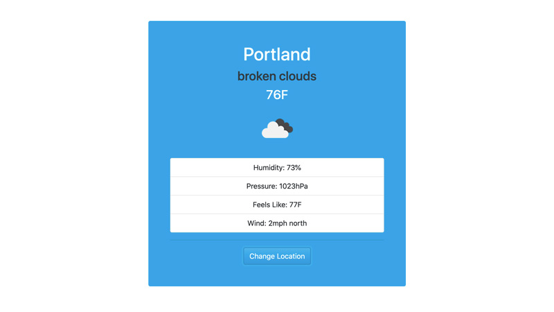

# _Weather App_

#### This is a web-based weather application that uses the Open Weather API for up-to-date weather forecasts.

#### _10/2021_

#### By _**Chris Korsak**_

## Description

This weather application is based on a project from [Modern JavaScript From the Beginning](https://www.udemy.com/course/modern-javascript-from-the-beginning). However, it instead retrieves data from the [Open Weather API](https://openweathermap.org/api) because the API used in the tutorial is no longer public. It also integrates a serverless function via [Netlify](https://www.netlify.com/), which means the API call is being done on the back-end. This hides the API key from the browser, thus keeping it secure from a nefarious user.

Additionally, this application uses local browser storage for persistent location storage without needing a database.

### Features/Highlights
* Up to date weather report for any city in the world using data from the Open Weather API.
* Weather app defaults to Washington D.C. if no location has been input.
* Your location is saved in browser local storage so you don't have to input it again if you leave the page.
* The API call is done on the back-end using a Netlify serverless function.

## Setup/Installation Requirements

This is a web-based application hosted on Netlify. Check out the app [here!](https://hungry-galileo-7e01f2.netlify.app)

## Technologies Used

* HTML
* CSS (Bootstrap & Bootswatch theme)
* JavaScript (including local storage, JavaScript classes, fetch, and more!)
* NPM (axios & netlify-cli packages)

  
